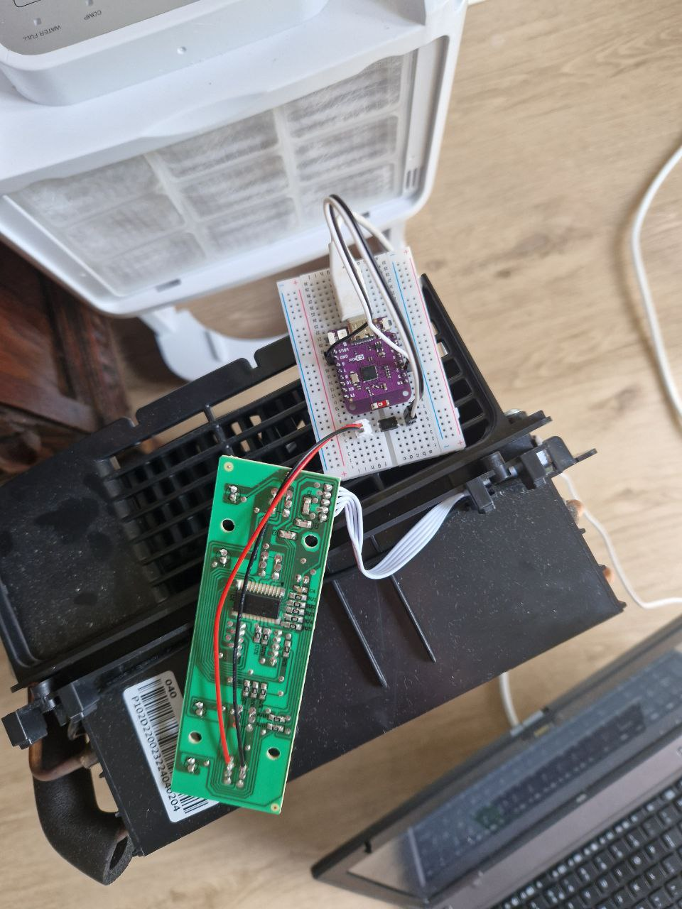

# mPy Dehumidifier Remote

This project is a remote control for a dehumidifier using the mPy microcontroller. It allows you to control the dehumidifier remotely using a web interface.

## Features

- Turn the dehumidifier on and off remotely
- Monitor the current humidity level (future)
- View the status of the dehumidifier (future)

## Getting Started

To get started with the mPy Dehumidifier Remote, follow these steps:

1. Clone this repository: `git clone https://github.com/kcvanderlinden/mPy-Dehumidifier-remote.git`
2. Upload code to micropython device
3. adjust the config variables (future)

## Prototype of board

## Future work
- Read leds from dehumidifier
- Add temprature and humidity sensor (DHT22 or 11)
- Make a board design in KiCad and print it

## Contributing

Contributions are welcome! If you have any ideas for improvements or bug fixes, please submit a pull request.

## License

This project is licensed under the [MIT License](LICENSE).